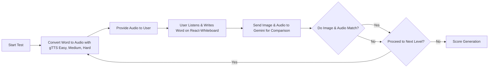
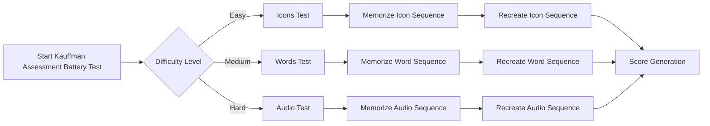

## Phonological Awareness Test

```mermaid
flowchart LR
    A[Start Test] --> B[Convert Word to Audio with gTTS Easy, Medium, Hard]
    B --> C[Provide Audio to User]
    C --> D[User Listens & Writes Word on React-Whiteboard]
    D --> E[Send Image & Audio to Gemini for Comparison]
    E --> F{Do Image & Audio Match?}
    F -->|Yes| G{Proceed to Next Level?}
    F -->|No| G
    G -->|Yes| B
    G -->|No| H[Score Generation]
```

```mermaid
flowchart LR
    A[Start Kauffman Assessment Battery Test] --> B{Difficulty Level}
    B -->|Easy| C[Icons Test]
    B -->|Medium| D[Words Test]
    B -->|Hard| E[Audio Test]
    
    C --> F[Memorize Icon Sequence]
    F --> G[Recreate Icon Sequence]
    
    D --> H[Memorize Word Sequence]
    H --> I[Recreate Word Sequence]
    
    E --> J[Memorize Audio Sequence]
    J --> K[Recreate Audio Sequence]
    
    G --> L[Score Generation]
    I --> L
    K --> L

    
    
```
