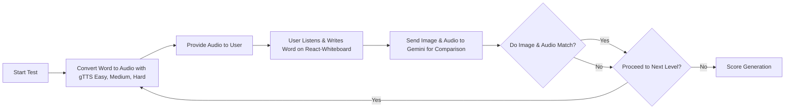

## Phonological Awareness Test

```mermaid
flowchart LR
    A[Start Test] --> B[Convert Word to Audio with gTTS Easy, Medium, Hard]
    B --> C[Provide Audio to User]
    C --> D[User Listens & Writes Word on React-Whiteboard]
    D --> E[Send Image & Audio to Gemini for Comparison]
    E --> F{Do Image & Audio Match?}
    F -->|Yes| G{Proceed to Next Level?}
    F -->|No| G
    G -->|Yes| B
    G -->|No| H[Score Generation]
```
